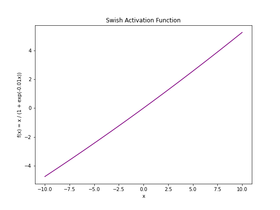

[](http://quantlet.de/)

## [](http://quantlet.de/) **swish** [](http://quantlet.de/)

```yaml

Name of QuantLet : 'swish'

Published in : 'LLM Examples' 

Description : 'changing of swish result according to beta'

Keywords : 'deep learning, swish'

Author : 'WK Haerdle Zuo Xiaorui'

Submitted : Mon, Jun 3 2024
```



### [IPYNB Code: swish.ipynb](swish.ipynb)


automatically created on 2024-06-04